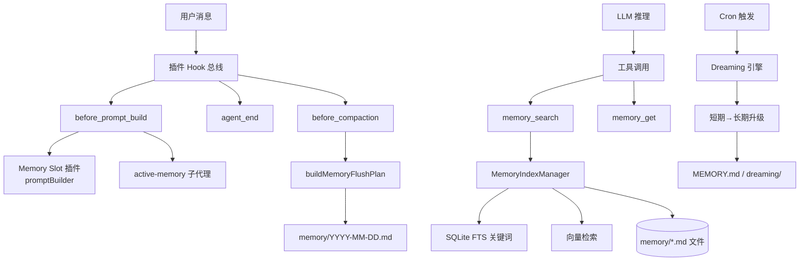
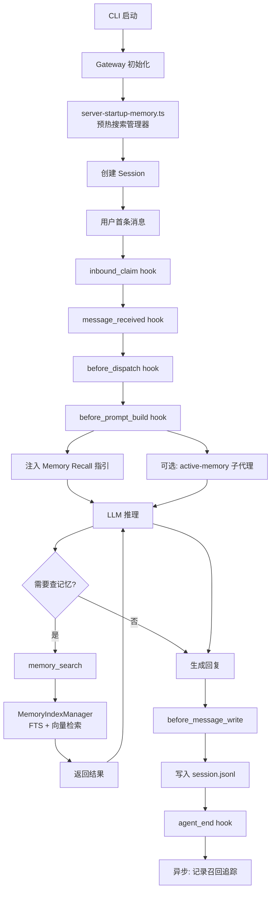

# 原版 OpenClaw 记忆系统全流程分析

> 本文档描述 **不加任何第三方插件（如 memory-milvus）** 的情况下，OpenClaw 官方默认记忆系统从用户首次对话到后续日常使用的完整运行机制。  
> 适用对象：希望理解 OpenClaw 记忆体系、对比自研插件实现、或在此基础上做二次开发的读者。

---

## 目录

1. [总体架构](#1-总体架构)
2. [官方内置的记忆相关插件](#2-官方内置的记忆相关插件)
3. [记忆 Slot 机制](#3-记忆-slot-机制)
4. [memory-core 插件内部结构](#4-memory-core-插件内部结构)
5. [记忆本体：物理存储与文件分类](#5-记忆本体物理存储与文件分类)
6. [写入流程（Capture / Flush）](#6-写入流程capture--flush)
7. [检索流程（Recall / Inject）](#7-检索流程recall--inject)
8. [Dreaming：后台记忆整理](#8-dreaming后台记忆整理)
9. [用户首次对话的完整时序](#9-用户首次对话的完整时序)
10. [后续对话的记忆复用](#10-后续对话的记忆复用)
11. [关键源码位置索引](#11-关键源码位置索引)

---

## 1. 总体架构

OpenClaw 的记忆系统遵循**记忆本体与检索层严格分离**的设计原则：

- **记忆本体**：用户/Agent 工作空间下的 Markdown 文件（`MEMORY.md`、`memory/*.md`、`DREAMS.md` 等）。这是记忆的**单一事实来源**。
- **检索层**：builtin（SQLite FTS + 向量）、QMD、LanceDB 等。它们只是对 `.md` 文件构建索引、提供搜索能力，**不存储记忆本身**。

系统组件关系：



核心能力可概括为 **五层**：

| 层           | 能力                                          | 负责组件                                |
| ------------ | --------------------------------------------- | --------------------------------------- |
| 1 搜索质量   | 混合检索（BM25 + 向量）、时间衰减、MMR 多样性 | `memory-core` 的 `MemoryIndexManager`   |
| 2 自主捕获   | 压缩时 LLM 驱动提取、追加写 .md               | `memory-core` 的 `buildMemoryFlushPlan` |
| 3 自主注入   | system prompt 注入、工具调用引导、子代理召回  | `buildPromptSection`、`active-memory`   |
| 4 记忆消化   | 短期→长期升级、三阶段梦                       | `memory-core` 的 Dreaming 引擎          |
| 5 Agent 集成 | Citations、slot 选择、Session 隔离            | `src/plugins/memory-state.ts`           |

---

## 2. 官方内置的记忆相关插件

| 插件 ID            | kind               | 职责                                                       | 默认启用                 |
| ------------------ | ------------------ | ---------------------------------------------------------- | ------------------------ |
| **memory-core**    | `memory`           | 默认记忆系统：文件后端 + 搜索工具 + Dreaming 整理          | ✅ 默认占据 memory slot  |
| **memory-lancedb** | `memory`           | 基于 LanceDB 的向量长期记忆，支持 autoCapture / autoRecall | ❌ 需手动启用并切换 slot |
| **memory-wiki**    | —（编译器/知识库） | 持久化 Wiki 编译、Obsidian 友好渲染、作为 corpus 补充      | ❌ 可选                  |
| **active-memory**  | —（独立插件）      | 在回复前阻塞式运行记忆子代理，向主 prompt 注入相关记忆     | ❌ 可选                  |

> **注意**：`active-memory` 与 memory slot **相互独立**——无论你选哪个记忆后端（memory-core、memory-lancedb），它都可以独立运行作为"第二层召回"。

---

## 3. 记忆 Slot 机制

### 3.1 Slot 定义

在 [`src/config/types.plugins.ts`](../../src/config/types.plugins.ts#L19-L24) 中：

```ts
export type PluginSlotsConfig = {
  memory?: string; // 哪个插件拥有 memory slot
  contextEngine?: string; // 哪个插件拥有 context-engine slot
};
```

### 3.2 配置示例

```json
{
  "plugins": {
    "slots": {
      "memory": "memory-core" // 或 "memory-lancedb"、"none"
    },
    "entries": {
      "memory-core": { "enabled": true }
    }
  }
}
```

### 3.3 关键规则

- **同一时刻只有一个 memory slot 插件生效**（Memory 是 single-slot capability）。
- 未显式指定时，系统按启用的 `kind=memory` 插件推导默认值。
- `"none"` 显式禁用所有记忆功能。
- **例外**：即使 slot 指向 `memory-lancedb`，`memory-core` 仍会被加载来提供 Dreaming 能力（Dreaming 是 memory-core 独有）。

---

## 4. memory-core 插件内部结构

### 4.1 注册入口

[`extensions/memory-core/index.ts`](../../extensions/memory-core/index.ts#L24-L75)：

```ts
export default definePluginEntry({
  id: "memory-core",
  kind: "memory",
  register(api) {
    registerBuiltInMemoryEmbeddingProviders(api);
    registerShortTermPromotionDreaming(api);
    registerDreamingCommand(api);
    api.registerMemoryCapability({
      promptBuilder: buildPromptSection,         // 注入 "## Memory Recall"
      flushPlanResolver: buildMemoryFlushPlan,   // 构建压缩写入计划
      runtime: memoryRuntime,                    // 搜索管理器获取/关闭
      publicArtifacts: { listArtifacts: ... },   // 公开 artifact 查询
    });
    api.registerTool(/* memory_search */);
    api.registerTool(/* memory_get */);
    api.registerCli(/* memory CLI 子命令 */);
  },
});
```

### 4.2 四大核心能力

| 能力                | 实现文件                                                                          | 作用                                          |
| ------------------- | --------------------------------------------------------------------------------- | --------------------------------------------- |
| `promptBuilder`     | [`src/prompt-section.ts`](../../extensions/memory-core/src/prompt-section.ts)     | 向 system prompt 注入 "## Memory Recall" 指引 |
| `flushPlanResolver` | [`src/flush-plan.ts`](../../extensions/memory-core/src/flush-plan.ts#L95-L139)    | 生成压缩时的写入计划（路径、阈值、prompt）    |
| `runtime`           | [`src/runtime-provider.ts`](../../extensions/memory-core/src/runtime-provider.ts) | 管理 `MemorySearchManager` 生命周期           |
| `tools`             | [`src/tools.ts`](../../extensions/memory-core/src/tools.ts)                       | 提供 `memory_search`、`memory_get` 工具       |

### 4.3 搜索管理器

[`src/memory/manager.ts`](../../extensions/memory-core/src/memory/manager.ts) 中的 `MemoryIndexManager`：

- **混合搜索**：`searchKeyword`（SQLite FTS，BM25 打分）+ `searchVector`（向量相似度）→ `mergeHybridResults` 合并
- **时间衰减**：`applyTemporalDecayToHybridResults` 给较新的记忆更高权重
- **索引存储**：`chunks_fts`（FTS 表）、`chunks_vec`（向量表）、`embedding_cache`（嵌入缓存）

---

## 5. 记忆本体：物理存储与文件分类

### 5.1 存储位置

记忆根目录默认为：

```
~/.openclaw/agents/{agentId}/workspace/memory/
```

每个 agent 拥有独立的 workspace，天然提供 **Agent 级隔离**。

### 5.2 文件分类

| 路径                                               | 用途                        | 写入模式                | 生成者                    |
| -------------------------------------------------- | --------------------------- | ----------------------- | ------------------------- |
| `MEMORY.md`                                        | 主记忆索引 / 引导           | Read-only（系统不覆盖） | 用户 或 Dreaming 升级     |
| `memory/YYYY-MM-DD.md`                             | 每日短期记忆                | **Append-only** 追加    | 会话压缩 flush            |
| `memory/dreaming/*.md`                             | Dreaming 输出的长期升级记忆 | Append + 管理           | `memory-core` Dreaming    |
| `memory/.dreams/short-term-recall.json`            | 召回追踪元数据（JSON）      | 更新                    | `short-term-promotion.ts` |
| `memory/.dreams/phase-signals.json`                | Dreaming 阶段信号           | 更新                    | Dreaming 引擎             |
| `DREAMS.md` / `SOUL.md` / `TOOLS.md` / `AGENTS.md` | Workspace 引导文件          | **Read-only**           | 用户                      |

### 5.3 写入硬约束

在 [`src/flush-plan.ts:13-22`](../../extensions/memory-core/src/flush-plan.ts#L13-L22) 定义：

- 只能写到 `memory/YYYY-MM-DD.md`，不能在别处创建
- **APPEND-ONLY**：已存在则追加，不覆盖
- **不允许**时间戳变体文件名（如 `YYYY-MM-DD-HHMM.md`）
- `MEMORY.md`、`DREAMS.md`、`SOUL.md`、`TOOLS.md`、`AGENTS.md` **禁止改写**

---

## 6. 写入流程（Capture / Flush）

原版记忆系统的写入**不是基于关键词触发的即时捕获**，而是 **基于会话压缩的批量提取**。

### 6.1 触发条件

当会话转录达到以下任一阈值时触发：

- `softThresholdTokens` ≥ **4000 token**（软阈值）—— [`flush-plan.ts:10`](../../extensions/memory-core/src/flush-plan.ts#L10)
- `forceFlushTranscriptBytes` ≥ **2 MB** 转录字节数 —— [`flush-plan.ts:11`](../../extensions/memory-core/src/flush-plan.ts#L11)

两个阈值都可由用户在 `agents.defaults.compaction.memoryFlush` 配置中覆盖。

### 6.2 写入过程

流程发生在压缩前（`before_compaction` hook）：

1. 系统调用 `buildMemoryFlushPlan()`（[`flush-plan.ts:95-139`](../../extensions/memory-core/src/flush-plan.ts#L95-L139)）
2. 根据当前时间戳（用户时区）生成路径：`memory/YYYY-MM-DD.md`
3. 向 LLM 发送专门的 **memory_flush prompt**（system prompt + user prompt）
4. LLM 根据 prompt 指引，**自主提取**对话中的重要内容并写入 .md 文件
5. 写入完成后，转录被压缩/截断，新一轮对话开始

### 6.3 Flush Prompt 的关键指令

```
Pre-compaction memory flush.
Store durable memories only in memory/YYYY-MM-DD.md (create memory/ if needed).
Treat workspace bootstrap/reference files such as MEMORY.md, DREAMS.md, SOUL.md, TOOLS.md, and AGENTS.md as read-only during this flush.
If memory/YYYY-MM-DD.md already exists, APPEND new content only.
Do NOT create timestamped variant files; always use the canonical YYYY-MM-DD.md filename.
If nothing to store, reply with <silent-reply-token>.
```

### 6.4 写入内容特征

- **不是原始对话**：LLM 会做结构化总结
- **按天聚合**：同一天的 flush 都追加到同一个文件
- **可能为空**：如果 LLM 判断当次对话无需存储，可以输出 silent token 跳过

---

## 7. 检索流程（Recall / Inject）

记忆检索有 **两条通道**：

### 7.1 通道 A：工具调用式召回（默认）

由 LLM 自主决定何时搜索记忆：

1. **Prompt 注入**：`buildPromptSection`（[`prompt-section.ts:3-38`](../../extensions/memory-core/src/prompt-section.ts#L3-L38)）在 system prompt 里加一段 "## Memory Recall" 指引：

   > Before answering anything about prior work, decisions, dates, people, preferences, or todos: run `memory_search` on MEMORY.md + memory/\*.md + indexed session transcripts; then use `memory_get` to pull only the needed lines.

2. **工具可用**：
   - `memory_search(query, limit?, corpus?)`：混合搜索（BM25 + 向量）
   - `memory_get(path, from?, lines?)`：按路径读取文件片段

3. **LLM 自主决策**：推理时判断是否调用工具

4. **结果回注**：工具结果作为 tool response 喂回给 LLM

5. **召回追踪**：每次命中异步写入 `short-term-recall.json`（为 Dreaming 积累证据）

### 7.2 通道 B：active-memory 子代理（可选，阻塞式）

如果启用 [`active-memory`](../../extensions/active-memory/openclaw.plugin.json) 插件：

1. **before_prompt_build hook** 触发阻塞式子代理调用
2. 子代理接收用户消息（支持 `message` / `recent` / `full` 三种 queryMode）
3. 子代理独立判断是否召回、召回什么
4. 结果作为 `prependContext` 注入主 agent 的 system prompt

优势：不依赖主 LLM 的工具调用能力，强制每次都考虑记忆。  
代价：额外一次 LLM 调用（通常用小模型）。

### 7.3 检索质量控制

在 `MemoryIndexManager` 中：

- **Top-K 限制**：`maxSearchResults` 参数
- **时间衰减**：指数衰减，半衰期默认 14 天
- **MMR 多样性**：避免返回过度相似的多个片段
- **Citations**：可选附带 `Source: path#line`，便于用户验证

---

## 8. Dreaming：后台记忆整理

Dreaming 是 memory-core 的**独有能力**，负责将频繁被召回的短期记忆升级为长期记忆。

### 8.1 三阶段架构

配置位置：[`extensions/memory-core/openclaw.plugin.json`](../../extensions/memory-core/openclaw.plugin.json) → `dreaming.phases`

| 阶段                      | 目标                 | 关键参数                                                                         |
| ------------------------- | -------------------- | -------------------------------------------------------------------------------- |
| **Light Sleep（浅睡）**   | 去重、降噪           | `lookbackDays`、`limit`、`dedupeSimilarity`                                      |
| **REM Sleep（快速眼动）** | 模式提取、概念标记   | `lookbackDays`、`limit`、`minPatternStrength`                                    |
| **Deep Sleep（深睡）**    | 长期升级、重要性评分 | `limit`、`minScore`、`minRecallCount`、`minUniqueQueries`、`recencyHalfLifeDays` |

### 8.2 升级判定

在 [`short-term-promotion.ts:23-25`](../../extensions/memory-core/src/short-term-promotion.ts#L23-L25)：

```ts
export const DEFAULT_PROMOTION_MIN_SCORE = 0.75;
export const DEFAULT_PROMOTION_MIN_RECALL_COUNT = 3;
export const DEFAULT_PROMOTION_MIN_UNIQUE_QUERIES = 2;
```

加权打分用的权重（[`short-term-promotion.ts:52-59`](../../extensions/memory-core/src/short-term-promotion.ts#L52-L59)）：

| 权重维度      | 默认值 | 含义         |
| ------------- | ------ | ------------ |
| frequency     | 0.24   | 召回频次     |
| relevance     | 0.30   | 相关性分数   |
| diversity     | 0.15   | 查询多样性   |
| recency       | 0.15   | 近因性       |
| consolidation | 0.10   | 已整合程度   |
| conceptual    | 0.06   | 概念标签覆盖 |

满足阈值的短期记忆被追加到 `memory/dreaming/` 目录，成为长期稳定记忆。

### 8.3 触发机制

- **Cron 驱动**：默认 `0 3 * * *`（每天凌晨 3 点，UTC）
- **可调时区**：`dreaming.timezone`
- **也可手动**：`openclaw memory dreaming run`

---

## 9. 用户首次对话的完整时序

以下为用户在一个**全新 agent** 下发送第一条消息时，记忆系统的参与路径：



### 详细步骤

| 步骤 | 发生的事                                                                             | 关键代码                                                                              |
| ---- | ------------------------------------------------------------------------------------ | ------------------------------------------------------------------------------------- |
| 1    | CLI 启动、Gateway 初始化                                                             | `src/gateway/server-startup-memory.ts`                                                |
| 2    | 遍历所有 agent，预热记忆搜索管理器（QMD 模式会预热，builtin 按需懒加载）             | [`server-startup-memory.ts:9-35`](../../src/gateway/server-startup-memory.ts#L9-L35)  |
| 3    | 创建 session（首次对话），若 `startupContext.enabled` 则预加载最近一条 daily memory  | 会话创建路径                                                                          |
| 4    | 用户消息到达，依次触发 `inbound_claim` → `message_received` → `before_dispatch`      | [`src/plugins/hooks.ts`](../../src/plugins/hooks.ts)                                  |
| 5    | `before_prompt_build` hook 被触发                                                    | [`hooks.ts:530-540`](../../src/plugins/hooks.ts#L530-L540)                            |
| 6    | memory slot 插件的 `promptBuilder` 注入 "## Memory Recall" 段                        | [`prompt-section.ts:3-38`](../../extensions/memory-core/src/prompt-section.ts#L3-L38) |
| 7    | （可选）`active-memory` 运行子代理，结果也加到 system prompt                         | [`active-memory/index.ts`](../../extensions/active-memory/index.ts)                   |
| 8    | LLM 拿到完整 prompt 推理。工具列表里包含 `memory_search` 和 `memory_get`             |                                                                                       |
| 9    | LLM 决定是否调用 `memory_search`。**首次对话通常不会调用**（因为没有历史记忆可查）。 | [`tools.ts`](../../extensions/memory-core/src/tools.ts)                               |
| 10   | LLM 生成回复                                                                         |                                                                                       |
| 11   | `before_message_write` hook 同步验证后，消息写入 `session.jsonl`                     | [`hooks.ts:894-948`](../../src/plugins/hooks.ts#L894-L948)                            |
| 12   | `agent_end` hook 异步触发，fire-and-forget                                           | [`hooks.ts:584-589`](../../src/plugins/hooks.ts#L584-L589)                            |

**关键点**：首次对话时，**没有任何内容被写入 `memory/` 目录**。记忆写入只有在以下两种情况才会发生：

- 转录达到 **4000 token** 或 **2 MB** 的阈值 → 触发 flush
- 用户手动执行 `/memory` 或 CLI 强制压缩

---

## 10. 后续对话的记忆复用

### 10.1 与首次对话的差异

| 维度                   | 首次对话 | 后续对话                                                 |
| ---------------------- | -------- | -------------------------------------------------------- |
| Session                | 新建     | 复用现有 session 或创建新 session                        |
| 消息历史               | 无       | 从 `session.jsonl` 加载                                  |
| Memory 文件            | 通常为空 | 存在若干 `YYYY-MM-DD.md`                                 |
| `memory_search` 命中率 | 几乎为 0 | 随记忆积累逐步上升                                       |
| Dreaming 产物          | 无       | 若已过阈值，`memory/dreaming/` 和 `MEMORY.md` 有升级条目 |

### 10.2 跨会话记忆复用路径

```
用户问题 → memory_search("类似查询")
  → MemoryIndexManager 混合检索
    → 命中 memory/2025-05-01.md#L23-L45
    → 命中 memory/dreaming/high-value-20250420.md
  → 结果回注 LLM
  → LLM 基于记忆生成回答
  → 异步: short-term-recall.json 累加该片段的召回次数
```

### 10.3 记忆的生命周期

```
新对话产生内容
  ↓
触发压缩 → 写入 memory/YYYY-MM-DD.md (短期记忆)
  ↓
被 memory_search 多次命中
  ↓
short-term-recall.json 累计证据
  ↓
Cron 触发 Dreaming
  ↓
Light Sleep 去重 → REM Sleep 模式提取 → Deep Sleep 升级
  ↓
满足 minScore ≥ 0.75 & minRecallCount ≥ 3 & minUniqueQueries ≥ 2
  ↓
升级到 memory/dreaming/*.md（长期稳定记忆）
  ↓
进一步可能被纳入 MEMORY.md 主索引
```

### 10.4 Session / Agent 隔离

- **同一 agent 跨 session**：共享 `workspace/memory/`，记忆全局可见
- **不同 agent**：workspace 路径隔离，记忆互不可见
- **active-memory 子代理**：独立的 session key（包含 `:active-memory:` 标记），不污染主对话记忆

---

## 11. 关键源码位置索引

### 核心类型定义

| 类型                     | 文件                                                                                 |
| ------------------------ | ------------------------------------------------------------------------------------ |
| `PluginSlotsConfig`      | [`src/config/types.plugins.ts:19-24`](../../src/config/types.plugins.ts#L19-L24)     |
| `MemoryPluginCapability` | [`src/plugins/memory-state.ts:127-132`](../../src/plugins/memory-state.ts#L127-L132) |
| `MemoryFlushPlan`        | [`src/plugins/memory-state.ts:67-74`](../../src/plugins/memory-state.ts#L67-L74)     |
| `MemoryPluginRuntime`    | [`src/plugins/memory-state.ts:96-110`](../../src/plugins/memory-state.ts#L96-L110)   |

### memory-core 插件

| 功能            | 文件                                                                                                             |
| --------------- | ---------------------------------------------------------------------------------------------------------------- |
| 插件入口        | [`extensions/memory-core/index.ts`](../../extensions/memory-core/index.ts)                                       |
| Prompt 注入     | [`extensions/memory-core/src/prompt-section.ts`](../../extensions/memory-core/src/prompt-section.ts)             |
| Flush Plan 构建 | [`extensions/memory-core/src/flush-plan.ts`](../../extensions/memory-core/src/flush-plan.ts)                     |
| 工具定义        | [`extensions/memory-core/src/tools.ts`](../../extensions/memory-core/src/tools.ts)                               |
| 搜索管理器      | [`extensions/memory-core/src/memory/manager.ts`](../../extensions/memory-core/src/memory/manager.ts)             |
| Dreaming 主控   | [`extensions/memory-core/src/dreaming.ts`](../../extensions/memory-core/src/dreaming.ts)                         |
| 短期升级        | [`extensions/memory-core/src/short-term-promotion.ts`](../../extensions/memory-core/src/short-term-promotion.ts) |
| 插件清单        | [`extensions/memory-core/openclaw.plugin.json`](../../extensions/memory-core/openclaw.plugin.json)               |

### 核心 runtime / 框架层

| 功能               | 文件                                                                                 |
| ------------------ | ------------------------------------------------------------------------------------ |
| Hook 总线          | [`src/plugins/hooks.ts`](../../src/plugins/hooks.ts)                                 |
| Memory 状态注册    | [`src/plugins/memory-state.ts`](../../src/plugins/memory-state.ts)                   |
| Gateway 启动时预热 | [`src/gateway/server-startup-memory.ts`](../../src/gateway/server-startup-memory.ts) |
| Memory 运行时      | `src/plugins/memory-runtime.ts`                                                      |

### 其他官方插件

| 插件           | 文件                                                             |
| -------------- | ---------------------------------------------------------------- |
| memory-lancedb | [`extensions/memory-lancedb/`](../../extensions/memory-lancedb/) |
| memory-wiki    | [`extensions/memory-wiki/`](../../extensions/memory-wiki/)       |
| active-memory  | [`extensions/active-memory/`](../../extensions/active-memory/)   |

---

## 附：与 memory-milvus（第三方插件）对比要点

| 维度       | memory-core（原版）              | memory-milvus（自研）               |
| ---------- | -------------------------------- | ----------------------------------- |
| 记忆本体   | 本地 `.md` 文件                  | Milvus 向量库条目                   |
| 写入触发   | 压缩前批量 flush（≥4000 token）  | `agent_end` 全量捕获（Honcho 风格） |
| 检索方式   | BM25 + 向量混合 + 时间衰减 + MMR | 向量相似度（可加 LLM 提取）         |
| Dreaming   | ✅ 三阶段完整流程                | ❌ 无（或只有 extraction）          |
| Citations  | ✅ 支持                          | ❌ 通常没有                         |
| 文件可读性 | ✅ 人类可直接阅读 `.md`          | ❌ 向量库内部存储                   |
| 跨机器同步 | git 同步 `.md` 即可              | 需要 Milvus 数据迁移                |
| Agent 隔离 | workspace 天然隔离               | 需自行按 collection/partition 区分  |

---

> **总结**：原版 OpenClaw 记忆系统的设计哲学是 **"文件为本、索引为用"**——记忆永远是人类可读的 Markdown，检索层只是加速器。写入策略走的是 **"压缩前 LLM 提取"** 路线，而不是实时捕获；注入策略通过 **"prompt 引导 + 工具调用"** 让模型自主判断何时用记忆；Dreaming 则为长期记忆提供了自动整理的闭环。
